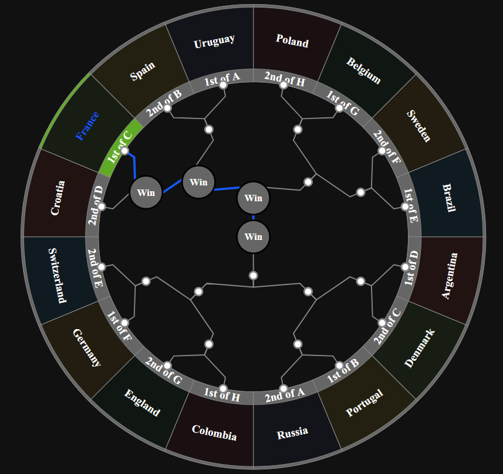

# ADS Project 5: 

Term: Spring 2018

+ Team #6

+ Projec title: Till the Top of The World


+ Team members
	+ team member 1: Hong, Peifeng ph2534@columbia.edu
	+ team member 2: He, Shan sh3667@columbia.edu
	+ team member 3: Kang, Yuhao yk2758@columbia.edu
	+ team member 4: Li, Xueyao xl2719@columbia.edu
	+ team member 5: Liu, Shiyu sl4258@columbia.edu
	
+ Project summary: 

  This summer, one of the most famous and world-wide banquet, the World Cup, will be held in Russia through June and     July. This championship draws the attention from the people all over the world for every single time. As a             consequence, it will be significantly intriguing on knowing something about the World Cup and making predictions on    it.

  For this project, our team makes a shiny app on showing all of the informaion about all the 16 teams we assumed in     the round 16 elimination stage. Simultaneously, we also make our own predictions on who will get to the end of the     championship by creating our own models. 
  
  You can find all of the useful information about soccer and World Cup in our app, and you can also check out our       predictions in it. Try it, enjoy it!
	
	Here is the link of our shiny app:
	
	https://xueyao0917.shinyapps.io/FIFAWorldCup/
	
	Here is the first look of our predictions of the entire elimination stages:
	
  
  
**Contribution statement**:

1. Xueyao Li, Yuhao Kang and Peifeng Hong creates the shiny app and fill in all the information of the 2018 World Cup together.

2. Shiyu Liu and Shan He work on the presonalized rating of each team and make the prediction on the elimination stage together.

Following [suggestions](http://nicercode.github.io/blog/2013-04-05-projects/) by [RICH FITZJOHN](http://nicercode.github.io/about/#Team) (@richfitz). This folder is orgarnized as follows.

```
proj/
|-- lib/
|-- data/
|-- doc/
|-- figs/
|-- output/
```

Please see each subfolder for a README file.
